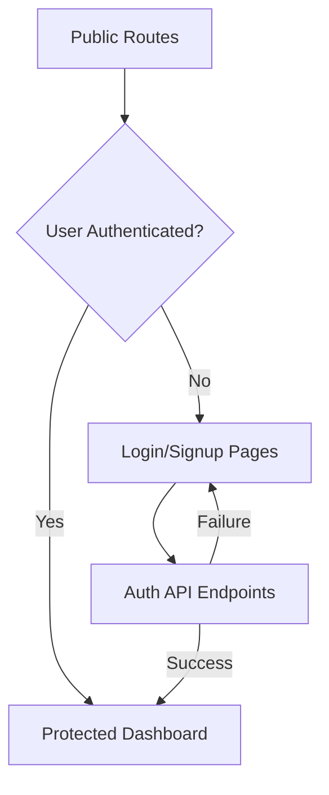
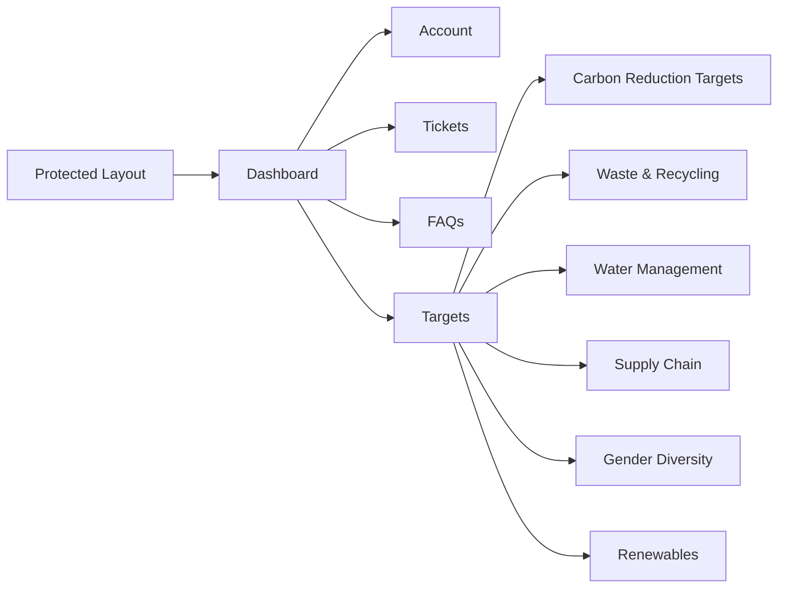
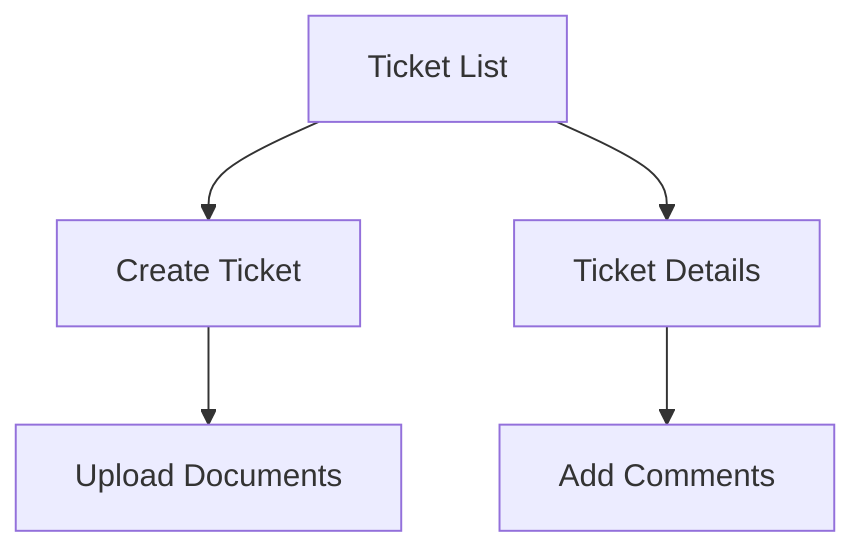

# ESGRoadmap Platform Documentation

[Status Key: 🟢 Developed | 🟡 Partially Developed | 🔴 Scaffolding/To-Do]

## Table of Contents
1. [Overview](#overview)
2. [Technical Stack](#technical-stack)
3. [Database Architecture](#database-architecture)
4. [Core Features](#core-features)
5. [Authentication & Authorization](#authentication--authorization)
6. [API Structure](#api-structure)

## Overview

ESGRoadmap is a comprehensive platform for tracking and analyzing Environmental, Social, and Governance (ESG) data across multiple companies. The platform provides tools for monitoring ESG targets, managing portfolios, and analyzing company commitments across various sustainability metrics.

### Key Features
- ESG target tracking and analysis
- Company portfolio management
- Support ticket system
- Subscription-based access levels
- Data export capabilities
- Rich text documentation support

## Technical Stack 🟢

### Core Technologies
- **Frontend**: Next.js 14.2.3
- **Backend**: Node.js with Next.js API routes
- **Database**: MySQL with Prisma ORM
- **Authentication**: JWT-based authentication
- **UI Components**:
  - PrimeReact
  - TailwindCSS
  - React-Quill for rich text editing
  - Shadcn UI components
- **Payment Processing**: Stripe integration

### Key Dependencies
- Prisma for database management
- React-Pro-Sidebar for navigation
- Zod for schema validation
- XLSX for data export
- React-Toastify for notifications
- Lucide icons

## Database Architecture 🟡

### Core Data Models

#### 1. Company Data 🔴
- Company Universe tracking
- ESG metrics and targets
- Sector classifications (NAICS)
- Company metadata and documentation
- Source documentation links
- Press release tracking
- **ESG Data Views**:
  - Carbon targets
  - Waste management
  - Supplier relationships
  - Renewable energy commitments
  - Water management
  - Gender diversity

#### 2. User Management 🟢
```prisma
model User {
  username  String
  email     String
  password  String
  isActive  Boolean
  plan      String // Subscription tier (Basic, Comprehensive)
  role      String // Access control (Regular, Admin)
  stripeId  String? // Payment integration
}
```

#### 3. Support System 🟡
```prisma
model Ticket {
  title       String
  description String
  status      String // Open, Closed, etc.
  documents   TicketDocument[]
  comments    TicketComment[]
}
```

#### 4. Portfolio Management 🔴
```prisma
model Portfolio {
  name      String
  filters   Json    // Customizable filters
  tableName String  // Target data table
}
```

## Core Features

### 1. ESG Data Tracking 🟡
- Comprehensive target monitoring and analysis
- Historical data tracking
- Source documentation linking
- Data export to CSV/Excel
Status: Basic data display and export functionality implemented. Source documentation linking and historical data tracking pending.

### 2. Portfolio Management 🔴
- Custom portfolio creation
- Filter-based company selection
- Multiple table support
- Export capabilities
- Customizable filters
Status: Database schema defined. UI components and API routes pending implementation.

### 3. Support System 🟡
- Ticket creation and tracking with different statuses (Open, Closed, etc.)
- File attachments for tickets
- Comment threading on tickets
- Dedicated page for viewing ticket details (/dashboard/tickets/details/[id])
Status: Core ticket functionality implemented. Status management and role-based access control need enhancement.

### 4. User Management 🟡
- Role-based access control (Regular, Admin)
- Subscription tiers (Basic, Comprehensive)
- Profile management (username, email) with secure password updates and change functionality
- Basic timestamp tracking (created, updated)
Status: Basic user management implemented. Subscription management and Stripe integration pending.

### 5. FAQ System 🟢
- Categorized FAQs
- Rich text support
- Image embedding
- External links
Status: Fully implemented with static content. Can be enhanced with dynamic content management.

## Authentication & Authorization 🟡

- JWT-based authentication with logout functionality
- Role-based access control (Regular, Admin)
- Subscription-based feature access (Basic, Comprehensive)
- Secure password handling
- Cookie-based session management
Status: Core authentication implemented. Subscription-based access control needs enhancement.

### 1 . Authentication Flow



#### Authentication Details

- Public Routes (/app/(public)/)
    - Login (/auth/login)
    - Signup (/auth/sign-up)
    - Lost Password (/auth/lost-password)
    - Membership Management (/auth/membership-account/*)
- Authentication API (/app/api/auth/)
    - Login: JWT-based authentication
    - Signup: Creates new user with hashed password
    - Profile Management: Update user details (username, email)
    - Password Change: Secure password updates
    - Session Management: Cookie-based token storage
    - /api/auth/me: Retrieves the currently authenticated user's data
    - /api/auth/logout: Logs out the user

### 2. Protected Routes & Dashboard Features



#### Dashboard Features
- Main Dashboard (/dashboard/)
    - Basic Account Tools (accessible to Basic plan)
    - Comprehensive Account Tools (accessible to Comprehensive plan)
    - Member Information
    - Account Details
- Targets System (/dashboard/targets/[id])
    - Allows users to view, filter, sort, save filters, and export company-specific ESG targets.
    - Provides access to detailed target information, including historical data and source documentation.
    - Dedicated pages for each target category (e.g., /dashboard/targets/carbon-reduction)

### 3. Support Ticket System



#### Ticket Management

##### Routes:
- List: /dashboard/tickets
- Create: /dashboard/tickets/new
- Details: /dashboard/tickets/details/[id]
- Comments: API endpoint /api/tickets/comment/[id]

##### Features:
- Document attachments
- Comment threading
- Status tracking (Open, Closed, etc.)
- Role-based access control

## API Structure 🟡

```mermaid
graph TD
    A[/api/] --> B[/api/auth/]
    A --> C[/api/tickets/]
    A --> D[/api/portfolio/]
    A --> E[/api/subscription/]
    B --> F[/api/auth/login] # 🟢
    B --> G[/api/auth/logout] # 🟢
    B --> H[/api/auth/me] # 🟢 Returns the currently authenticated user's data
    B --> I[/api/auth/signup] # 🟢
    B --> J[/api/auth/profile] # 🟢 Updates user's profile (username, email)
    B --> K[/api/auth/password/change] # 🟢 Allows password change
    C --> L[/api/tickets/ - GET (List tickets)] # 🟡
    C --> M[/api/tickets/ - POST (Create ticket)] # 🟢
    C --> N[/api/tickets/details/[id]] # 🟡 GET (Retrieve a specific ticket), PUT/PATCH (Update a ticket)
    C --> O[/api/tickets/comment/[id]] # 🟢 POST (Add a comment to a ticket)
    D --> P[/api/portfolio/ - GET (List portfolios)] # 🔴
    D --> Q[/api/portfolio/ - POST (Create portfolio, Save custom filters)] # 🔴
    E --> R[/api/subscription/cancel] # 🔴 Cancel user's subscription
```

### Layout Structure 🟢
- Public Layout: Header + Footer for authentication pages.
- Protected Layout: Sidebar navigation (implemented with React-Pro-Sidebar) + dynamic content area. The layout is static but changes content based on client-side routing.
- Loading States: NextTopLoader for route transitions.
Status: Fully implemented and functional.